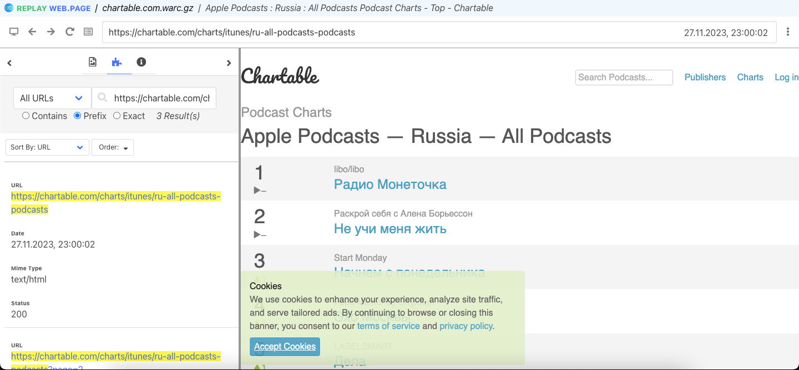
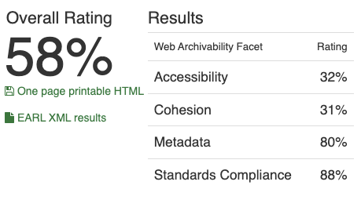

# Архив топа подкастов на Apple Music с сайта аналитики chartable.com

## 1. Работа с Wpull

### Саммари

Этот раздел содержит результаты архивации сайта с использованием инструмента Wpull.
В ходе работы использовался скрипт массовой загрузки для извлечения коллекции нескольких архивов последовательно. Параметр глубины рекурсии выставлен на `r=5` для ограничения по времени и памяти для архивации. При архивации более чем 1ч.30мин, прерываем выполнение работы архиватора

### Результаты

Открыв сохранившийся `.warc.gz` с помощью инструмента просмотра веб-архивов `ReplayWeb.page`, мы можем наблюдать что данные Apple-подкастов с сайта Chartable успешно архивировались.
Из интересующих данных аналитики успешно сохранились название, место в топе и динамика позиций подкастов за интересующий период. 
Тем не менее, рекуррентный обход страниц сайта позволил архивировать служебные страницы, в то время как перейти к описаниям подкастов не удается

## 2. Работа с Archive Ready

### Саммари

Этот раздел содержит результаты архивации сайта с использованием инструмента Archive Ready. В данном разделе мы пытаемся оценить архив не только с точки зрения постановленной задачи, но также с точки зрения стандартов архивирования в соостветствие в метриками CLEAR.

### Результаты

Рассматривая ресурс с точки зрения стандартных метрик веб-архивирования в `ArchiveReady`, мы можем наблюдать достаточно низкий общий не смотря на то что по нашим оценкам в предудущем пункте по работе с wpull этот ресурс казался позитивным примером.

- HTML and CSS: множество нерабочих ссылок, ошибок в нескольких HTML и CSS файлах
- HTTP: предупреждение по Accessibility и Metadata (“HTTP caching headers are not available.”), других ошибок нет
- Media: большинство картинок с внешних ресурсов, некоторые картинке не удовлетворяют фасету Standards Compliance 
- Sitemaps: accessibility: наличие Disallow в robots.txt, отсутствие sitemaps.xml

## 3. Работа с MetaWarc

### Саммари

Этот раздел содержит результаты архивации сайта с использованием инструмента MetaWarc.
В данной работе мы исследовали метаданные архива с помощью `metawarc` использовав несколько функций утилиты:
- analyze
- metadata
- index
- stats

### Описание работы

1. `metawarc analyze chartable.com.warc.gz`
<pre>
mimes                     files      size       share
----------------------  -------  --------  ----------
image/svg+xml               516   5263645   39.9979
application/javascript        3   4545541   34.5411
text/html                   213   2709176   20.5867
text/plain                  292    347224    2.63852
text/css                      2    207179    1.57433
image/png                    14     87043    0.661431
#total                     1040  13159808  100
</pre>

Мы можем видеть, как наибольшую долю на диске занимают изображения и `xml` разметка. Также стоит обратить внимание на `javascript` файлы, предположительно отвечающие за нерабочие картинки/элементы, что подтверждается при анализе сайта в `ArchiveReady`

2. `metawarc metadata --output digital_meta.jsonl chartable.com.warc.gz`

Результаты работы команды мы можем пронаблюдать в файле [`digital_meta.jsonl`](./digital_meta.jsonl).
Как мы видим, метаданные части файлов (в основном, изображений `png`) успешно сохранились, тем не менее для большей части файлов возникли ошибки (см. `errors.log`)

3. `metawarc index chartable.com.warc.gz`

В результате создана служебная БД `metawarc.db` содержащая HTTP метаданные для использования командой `stats`

4. `metawarc stats -m mimes`
<pre>
              Group by mime type               
┏━━━━━━━━━━━━━━━━━━━━━━━━━━━┳━━━━━━━━━┳━━━━━━━┓
┃ mime                      ┃ size    ┃ count ┃
┡━━━━━━━━━━━━━━━━━━━━━━━━━━━╇━━━━━━━━━╇━━━━━━━┩
│ application/javascript    │ 4545541 │     3 │
│ image/png                 │ 87043   │    14 │
│ image/svg+xml             │ 5263645 │   516 │
│ text/css                  │ 207179  │     2 │
│ text/html                 │ 4965    │     9 │
│ text/html; charset=UTF-8  │ 4957    │     1 │
│ text/html; charset=utf-8  │ 2699254 │   203 │
│ text/plain; charset=utf-8 │ 347224  │   292 │
└───────────────────────────┴─────────┴───────┘
</pre>

Как предполагалась по документации, возвращаются результаты эквивалентные пункту 1. `metawarc analyze`, но подсчитанные с помощью БД `metawarc.db`

5. `metawarc stats -m exts`

<pre>
    Group by file extension    
┏━━━━━━━━━━━┳━━━━━━━━━┳━━━━━━━┓
┃ extension ┃ size    ┃ count ┃
┡━━━━━━━━━━━╇━━━━━━━━━╇━━━━━━━┩
│           │ 2694567 │   213 │
│ css       │ 207179  │     2 │
│ gif       │ 2388    │     2 │
│ js        │ 4733063 │   160 │
│ png       │ 122875  │    44 │
│ svg       │ 5384243 │   617 │
│ ts        │ 15493   │     2 │
└───────────┴─────────┴───────┘
</pre>

- В переподсчете занимаемого места по расширениям, снова наблюдаем как большую часть пространства занимают изображения и `js`-файлы

