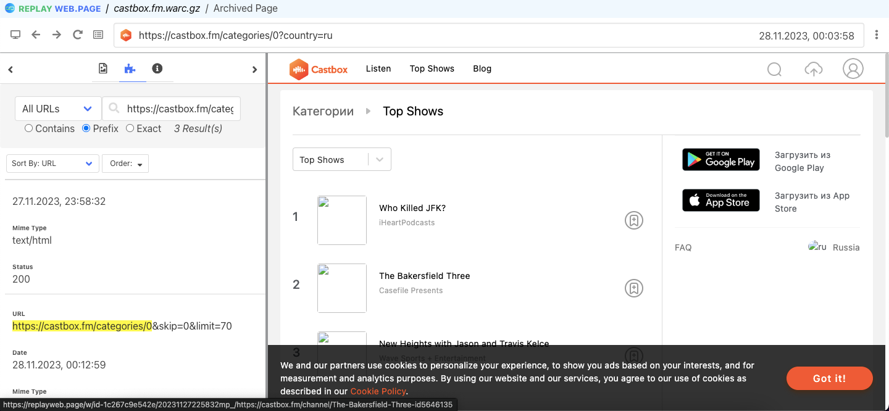
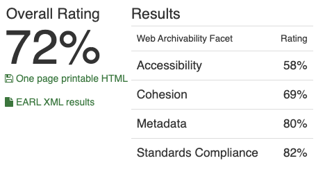

# Архив топа подкастов на Castbox

## 1. Работа с Wpull

### Саммари

Этот раздел содержит результаты архивации сайта с использованием инструмента Wpull.
В ходе работы использовался скрипт массовой загрузки для извлечения коллекции нескольких архивов последовательно. Параметр глубины рекурсии выставлен на `r=5` для ограничения по времени и памяти для архивации. При архивации более чем 1ч.30мин, прерываем выполнение работы архиватора

### Результаты

Открыв сохранившийся `.warc.gz` с помощью инструмента просмотра веб-архивов `ReplayWeb.page`, мы можем наблюдать что данные подкастов на Castbox относительно успешно: мы наблюдаем сам список подкастов, однако переход к русскоязычному топу в архиве не произошло, тк выбор региона/языка определяется через `javascript`, в следствие чего `wpull` успешно архивировал международный топ, но дальнейшие шаги рекурсии позволили лишь сохранить служебные страницы

## 2. Работа с Archive Ready

### Саммари

Этот раздел содержит результаты архивации сайта с использованием инструмента Archive Ready. В данном разделе мы пытаемся оценить архив не только с точки зрения постановленной задачи, но также с точки зрения стандартов архивирования в соостветствие в метриками CLEAR.

### Результаты

Интересно насколько умеренные скоры по всем фасетам получает сайт по сравнению с остальными сайтами из коллекции

- HTML and CSS: здесь также, множество валидных файлов и множество ошибок в других файлах по всем типам (“There are 39 valid and 1 invalid links.”), несколько ошибок в HTML и в CSS файлах – accessibility и standards compliance
- HTTP: предупреждение по Accessibility и Metadata (“HTTP caching headers are not available.”), других ошибок нет
- Media: также умеренный результат (“Local images found: 7, remote images found: 21”), все проверенные картинки правильно размечены и загружены, долгое время загрузки (721мс)
- Sitemaps: accessibility: наличие Disallow в robots.txt, наличие sitemaps.xml, но отсутствие его упоминания в robots.txt

## 3. Работа с MetaWarc

### Саммари

Этот раздел содержит результаты архивации сайта с использованием инструмента MetaWarc.
В данной работе мы исследовали метаданные архива с помощью `metawarc` использовав несколько функций утилиты:
- analyze
- metadata
- index
- stats

### Описание работы

1. `metawarc analyze castbox.fm.warc.gz`
<pre>
mimes                       files       size          share
------------------------  -------  ---------  -------------
text/html                     866  297507430   91.4536
application/javascript         75   15048620    4.62594
application/octet-stream       26    5008479    1.5396
image/jpeg                     28    3654194    1.1233
image/x-png                     7    1367812    0.420465
text/css                       32    1039947    0.319679
binary/octet-stream             3     473311    0.145496
application/x-font-ttf          5     460447    0.141541
image/png                      48     421037    0.129427
application/xml               385     237197    0.0729142
image/gif                       2      40361    0.012407
text/plain                     85      33182    0.0102001
image/svg+xml                   5      11953    0.00367435
                                5       2816    0.000865637
application/font-woff           1       1952    0.000600044
application/x-directory         1        463    0.000142326
application/json                1        345    0.000106053
#total                       1575  325309546  100
</pre>

Мы можем видеть, как в отличие от сайта chartable.com, в данном архиве представлены данные большего числа форматов, что по-видимому связано с тем, что в данном случае мы архивируем реальную страницу prod-сайта. Также интересно, как в данном случае наибольшую долю на диске занимают изображения и `text/html` файлы.

2. `metawarc metadata --output digital_meta.jsonl castbox.fm.warc.gz`

Результаты работы команды мы можем пронаблюдать в файле [`digital_meta.jsonl`](./digital_meta.jsonl).
Инетересно как в данном случае сохранилось большинство файлов, все успешно сохранившиеся файлы -- изображения (преимущественно .png и .jpg)

3. `metawarc index castbox.fm.com.warc.gz`

В результате создана служебная БД `metawarc.db` содержащая HTTP метаданные для использования командой `stats`

4. `metawarc stats -m mimes`
<pre>
                     Group by mime type                      
┏━━━━━━━━━━━━━━━━━━━━━━━━━━━━━━━━━━━━━━━┳━━━━━━━━━━━┳━━━━━━━┓
┃ mime                                  ┃ size      ┃ count ┃
┡━━━━━━━━━━━━━━━━━━━━━━━━━━━━━━━━━━━━━━━╇━━━━━━━━━━━╇━━━━━━━┩
│ None                                  │ 2816      │     5 │
│ application/font-woff                 │ 1952      │     1 │
│ application/javascript                │ 15037922  │    73 │
│ application/javascript; charset=UTF-8 │ 10698     │     2 │
│ application/json                      │ 345       │     1 │
│ application/octet-stream              │ 5008479   │    26 │
│ application/x-directory               │ 463       │     1 │
│ application/x-font-ttf                │ 460447    │     5 │
│ application/xml                       │ 237197    │   385 │
│ binary/octet-stream                   │ 473311    │     3 │
│ image/gif                             │ 40361     │     2 │
│ image/jpeg                            │ 3654194   │    28 │
│ image/png                             │ 418363    │    47 │
│ image/png;charset=UTF-8               │ 2674      │     1 │
│ image/svg+xml                         │ 11953     │     5 │
│ image/x-png                           │ 1367812   │     7 │
│ text/css                              │ 1039947   │    32 │
│ text/html                             │ 1124      │     2 │
│ text/html; charset=utf-8              │ 295320511 │   697 │
│ text/html;charset=UTF-8               │ 2185795   │   167 │
│ text/plain; charset=utf-8             │ 33182     │    85 │
└───────────────────────────────────────┴───────────┴───────┘
</pre>

Как предполагалась по документации, возвращаются результаты эквивалентные пункту 1. `metawarc analyze`, но подсчитанные с помощью БД `metawarc.db`

5. `metawarc stats -m exts`

<pre>
                                 Group by file extension                                  
┏━━━━━━━━━━━━━━━━━━━━━━━━━━━━━━━━━━━━━━━━━━━━━━━━━━━━━━━━━━━━━━━━━━━━┳━━━━━━━━━━━┳━━━━━━━┓
┃ extension                                                          ┃ size      ┃ count ┃
┡━━━━━━━━━━━━━━━━━━━━━━━━━━━━━━━━━━━━━━━━━━━━━━━━━━━━━━━━━━━━━━━━━━━━╇━━━━━━━━━━━╇━━━━━━━┩
│                                                                    │ 294416736 │   919 │
│ css                                                                │ 1503064   │    68 │
│ eot                                                                │ 616       │     1 │
│ fm                                                                 │ 334681    │    18 │
│ fm&skip=0&limit=50                                                 │ 267383    │    12 │
│ fm&skip=0&limit=50&skip=0&limit=50                                 │ 200431    │     9 │
│ fm&skip=0&limit=50&skip=0&limit=50&skip=0&limit=50                 │ 133590    │     6 │
│ fm&skip=0&limit=50&skip=0&limit=50&skip=0&limit=50&skip=0&limit=50 │ 68646     │     3 │
│ gif                                                                │ 41593     │     4 │
│ gz                                                                 │ 1232      │     2 │
│ html                                                               │ 4443      │     7 │
│ in                                                                 │ 616       │     1 │
│ jpg                                                                │ 9143376   │    69 │
│ js                                                                 │ 16747015  │   332 │
│ json                                                               │ 616       │     1 │
│ png                                                                │ 1804039   │    83 │
│ sub                                                                │ 111353    │     9 │
│ sub&skip=0&limit=50                                                │ 44676     │     2 │
│ svg                                                                │ 21193     │    20 │
│ t                                                                  │ 616       │     1 │
│ ts                                                                 │ 1232      │     2 │
│ ttf                                                                │ 460447    │     5 │
│ woff                                                               │ 1952      │     1 │
└────────────────────────────────────────────────────────────────────┴───────────┴───────┘
</pre>

- Интересно как в группировке по расширениям первое место занимают файлы без расширения, также интересно что следующую строчку занимают таблицы стилей, а изображения уже занимают более низкие позиции, что возможно также связано с масштабом сайта и тем что многие картинки подтягиваются динамически в `js`

