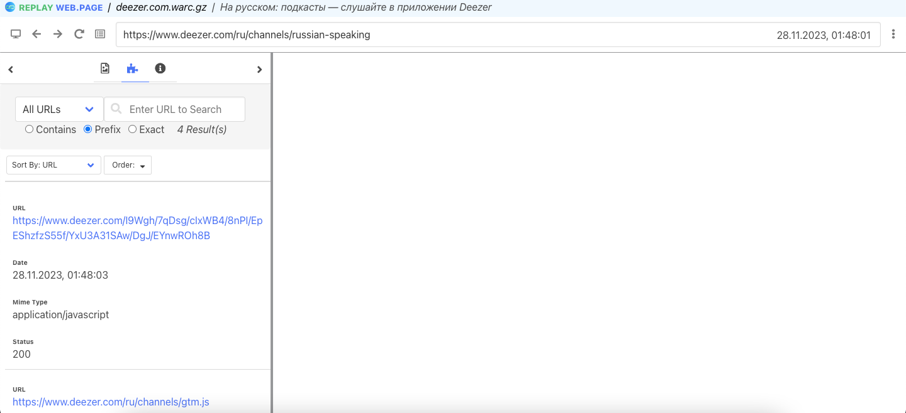
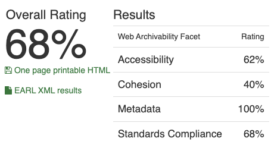

# Архив топа подкастов на Deezer

## 1. Работа с Wpull

### Саммари

Этот раздел содержит результаты архивации сайта с использованием инструмента Wpull.
В ходе работы использовался скрипт массовой загрузки для извлечения коллекции нескольких архивов последовательно. Параметр глубины рекурсии выставлен на `r=5` для ограничения по времени и памяти для архивации. При архивации более чем 1ч.30мин, прерываем выполнение работы архиватора

### Результаты

Чарт Deezer мы в ходе работы постарались загрузить дважды -- применяя разные настройки в команде `wpull`. Тем не менее, ни в одну из попыток файлы архива загрузить не удалось– предположительно сервис блокирует скачивание wpull или запрос wpull составлен не вполне подходящим образом для ресурса

## 2. Работа с Archive Ready

### Саммари

Этот раздел содержит результаты архивации сайта с использованием инструмента Archive Ready. В данном разделе мы пытаемся оценить архив не только с точки зрения постановленной задачи, но также с точки зрения стандартов архивирования в соостветствие в метриками CLEAR.

### Результаты

Интересно наблюдать высокий рейтинг сайта на портале ArchiveReady по метрикам CLEAR притом как с помощью wpull страницу не удалось загрузить за несколько попыток

- HTML and CSS: по несколько ошибок каждого типа (в HTML, в CSS, в ссылках)
- HTTP: без предупреждений и ошибок
- Media: долгое время ответа (3000мс), других ошибок нет
- Sitemaps: accessibility: наличие Disallow в robots.txt, но присутствует sitemaps.xml

## 3. Работа с MetaWarc

### Саммари

Этот раздел содержит результаты архивации сайта с использованием инструмента MetaWarc.
В данной работе мы исследовали метаданные архива с помощью `metawarc` использовав несколько функций утилиты:
- analyze
- metadata
- index
- stats

### Описание работы

1. `metawarc analyze deezer.com.warc.gz`
<pre>
mimes                     files    size     share
----------------------  -------  ------  --------
text/html                     2  297318   57.0357
application/javascript        1  223966   42.9643
#total                        3  521284  100
</pre>

Мы можем видеть с помощью `metawarc`, что `wpull` начинал загрузку и отработал. Тем не менее архив не сохраняется в виде доступном для запуска -- возможно это связанно с намеренными действиями компании против архивации и скрейпинга. Либо контент на странице Deezer подтягиваестя/переадресуется целиком через `javascript`

2. `metawarc metadata --output digital_meta.jsonl deezer.com.warc.gz`

Результаты работы команды мы можем пронаблюдать в файле [`digital_meta.jsonl`](./digital_meta.jsonl).
Ожидаемо, команда возвращает пустой файл

3. `metawarc index deezer.com.warc.gz`

В результате создана служебная БД `metawarc.db` содержащая HTTP метаданные для использования командой `stats`

4. `metawarc stats -m mimes`
<pre>
             Group by mime type              
┏━━━━━━━━━━━━━━━━━━━━━━━━━━┳━━━━━━━━┳━━━━━━━┓
┃ mime                     ┃ size   ┃ count ┃
┡━━━━━━━━━━━━━━━━━━━━━━━━━━╇━━━━━━━━╇━━━━━━━┩
│ application/javascript   │ 223966 │     1 │
│ text/html; charset=utf-8 │ 297318 │     2 │
└──────────────────────────┴────────┴───────┘
</pre>

5. `metawarc stats -m exts`

<pre>
   Group by file extension    
┏━━━━━━━━━━━┳━━━━━━━━┳━━━━━━━┓
┃ extension ┃ size   ┃ count ┃
┡━━━━━━━━━━━╇━━━━━━━━╇━━━━━━━┩
│           │ 520598 │     2 │
│ js        │ 686    │     1 │
└───────────┴────────┴───────┘
</pre>

- Интересно как в группировке по расширениям первое место занимают файлы без расширения
