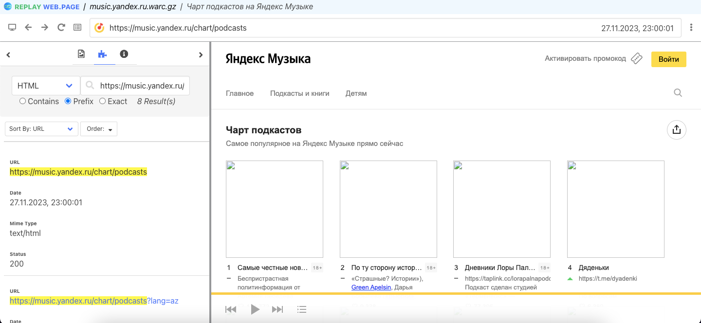
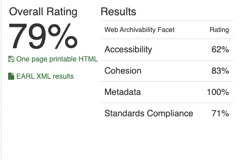

# Архив топа подкастов на Яндекс.музыке

## 1. Работа с Wpull

### Саммари

Этот раздел содержит результаты архивации сайта с использованием инструмента Wpull.
В ходе работы использовался скрипт массовой загрузки для извлечения коллекции нескольких архивов последовательно. Параметр глубины рекурсии выставлен на `r=5` для ограничения по времени и памяти для архивации. При архивации более чем 1ч.30мин, прерываем выполнение работы архиватора

### Результаты

Открыв сохранившийся `.warc.gz` с помощью инструмента просмотра веб-архивов `ReplayWeb.page`, мы можем наблюдать что данные подкастов на Яндекс музыки относительно успешно: нам доступны названия, авторы, позиция в чарте и количества лайков, однако рекурсия ушла в служебные страницы и перейти по ссылкам не удается. Кроме того, изображения не сархивировались, вероятно в силу того, что на сайте они подтягиваются в `javascript`

## 2. Работа с Archive Ready

### Саммари

Этот раздел содержит результаты архивации сайта с использованием инструмента Archive Ready. В данном разделе мы пытаемся оценить архив не только с точки зрения постановленной задачи, но также с точки зрения стандартов архивирования в соостветствие в метриками CLEAR.

### Результаты

На сайте `ArchiveReady` мы наблюдаем достаточно высокую общую оценку для чарта Яндекс музыки. Обращает на себя внимание 100% результат по фасету метаданных – согласно статье CLEAR, это может быть связано с наличием одновременно тегов lang, тегов отвечающих за семантическую разметку <dc>, <foaf>, <rdf> итд, прописанный тег <META> и другими метаданными. 

- в файлах сайта ArchiveReady находит сотни (393) ошибок в HTML, других проблем в документах нет (ссылки валидные, JS-скриптов в HTML нет итд)
- во вкладке HTTP ошибок нет (“Правильно определенные HTTP-заголовки помогают веб-ботам понять контент”).
- во вкладке медиа утверждается что картинок нет, что рассматривается как положительная черта тк снижает нагрузку на архивирование (на самом деле картинки на сайте есть, вероятно они подтягиваются в js, что не позволило wpull в прошлой работе их архивировать). Из ошибок приводится долгое время ответа (“Network response time is 3000 ms”) - что относится на ArchiveReady к фасету Accessibility а не Performance.
- вкладка Sitemaps указывает на ограничения Disallow в robots.txt, а также на ненайденный sitemaps.xml. 

## 3. Работа с MetaWarc

### Саммари

Этот раздел содержит результаты архивации сайта с использованием инструмента MetaWarc.
В данной работе мы исследовали метаданные архива с помощью `metawarc` использовав несколько функций утилиты:
- analyze
- metadata
- index
- stats

### Описание работы

1. `metawarc analyze music.yandex.ru.warc.gz`
<pre>
mimes                       files      size         share
------------------------  -------  --------  ------------
image/png                     222  13671515   36.0366
text/html                     276  10773011   28.3965
image/jpeg                     23   5813277   15.3232
application/javascript         10   4737262   12.4869
image/svg+xml                 598   1556747    4.10341
text/css                        1   1169580    3.08288
application/octet-stream        1    141703    0.373514
application/font-woff           1     54194    0.142849
image/x-icon                    4     20169    0.0531633
                                1       391    0.00103063
#total                       1137  37937849  100
</pre>

Мы видим как верхнии позиции в списке занимают изображения что коррелирует с высокой оценкой ArchiveReady в котором штрафуется прогрузка картинок динамически со сторонних ресурсов

2. `metawarc metadata --output digital_meta.jsonl music.yandex.ru.warc.gz`

Результаты работы команды мы можем пронаблюдать в файле [`digital_meta.jsonl`](./digital_meta.jsonl).
В подтверждение предыдущего пункта, в полученный файл удалось успешно собрать метаданную по более чем 240 изображениям с ресурса. 

3. `metawarc index music.yandex.ru.warc.gz`

В результате создана служебная БД `metawarc.db` содержащая HTTP метаданные для использования командой `stats`

4. `metawarc stats -m mimes`
<pre>
                     Group by mime type                     
┏━━━━━━━━━━━━━━━━━━━━━━━━━━━━━━━━━━━━━━━┳━━━━━━━━━━┳━━━━━━━┓
┃ mime                                  ┃ size     ┃ count ┃
┡━━━━━━━━━━━━━━━━━━━━━━━━━━━━━━━━━━━━━━━╇━━━━━━━━━━╇━━━━━━━┩
│ None                                  │ 391      │     1 │
│ application/font-woff                 │ 54194    │     1 │
│ application/javascript                │ 4518279  │     9 │
│ application/javascript; charset=utf-8 │ 218983   │     1 │
│ application/octet-stream              │ 141703   │     1 │
│ image/jpeg                            │ 5813277  │    23 │
│ image/png                             │ 13671515 │   222 │
│ image/svg+xml                         │ 1556747  │   598 │
│ image/x-icon                          │ 20169    │     4 │
│ text/css                              │ 1169580  │     1 │
│ text/html; charset=utf-8              │ 10773011 │   276 │
└───────────────────────────────────────┴──────────┴───────┘
</pre>

5. `metawarc stats -m exts`

<pre>
    Group by file extension     
┏━━━━━━━━━━━┳━━━━━━━━━━┳━━━━━━━┓
┃ extension ┃ size     ┃ count ┃
┡━━━━━━━━━━━╇━━━━━━━━━━╇━━━━━━━┩
│           │ 6961104  │     8 │
│ css       │ 1169580  │     1 │
│ ico       │ 20169    │     4 │
│ jpg       │ 5813277  │    23 │
│ js        │ 8078094  │   263 │
│ otf       │ 141703   │     1 │
│ png       │ 13685845 │   224 │
│ ru        │ 218983   │     1 │
│ st        │ 69979    │     1 │
│ svg       │ 1724921  │   610 │
│ woff      │ 54194    │     1 │
</pre>

- Интересно что в данном случае всевозможные расширения занимают близкий порядок места на диске
