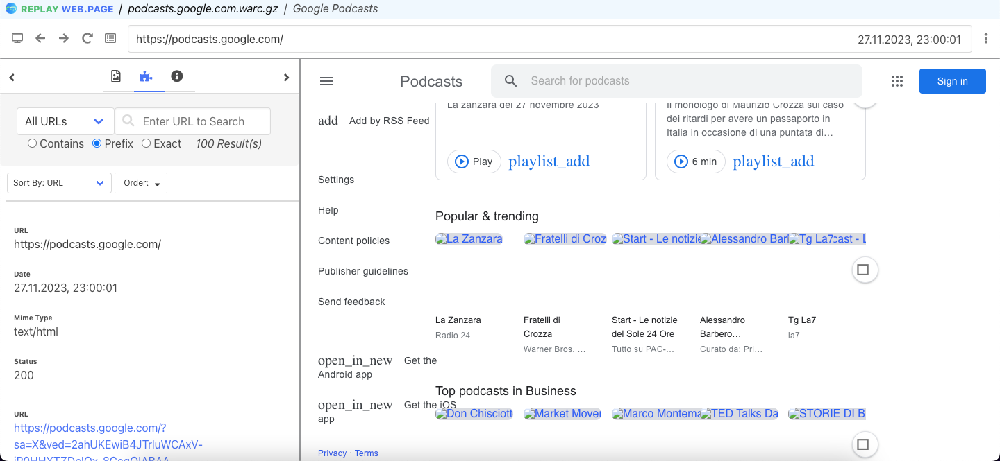
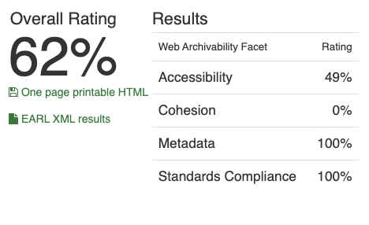

# Архив топа подкастов Google

## 1. Работа с Wpull

### Саммари

Этот раздел содержит результаты архивации сайта с использованием инструмента Wpull.
В ходе работы использовался скрипт массовой загрузки для извлечения коллекции нескольких архивов последовательно. Параметр глубины рекурсии выставлен на `r=5` для ограничения по времени и памяти для архивации. При архивации более чем 1ч.30мин, прерываем выполнение работы архиватора

### Результаты

Открыв сохранившийся `.warc.gz` с помощью инструмента просмотра веб-архивов `ReplayWeb.page`, мы можем констатировать, что данные Google-подкастов архивировались достаточно неудачно: тк регион/язык стартовой страницы определяется автоматически через js, выяснилось что в архивированной версии произвольно сохранилась итальянская версия сайта, хотя некоторые интересующие элементы (названия, шрифты, позиции в чарте) - сохранились в архиве

## 2. Работа с Archive Ready

### Саммари

Этот раздел содержит результаты архивации сайта с использованием инструмента Archive Ready. В данном разделе мы пытаемся оценить архив не только с точки зрения постановленной задачи, но также с точки зрения стандартов архивирования в соостветствие в метриками CLEAR.

### Результаты

Интересным кажется как два фасета Metadata и Compliance получают 100% оценку, в то время как Cohesion получает 0.
- Заметим что именно к Cohesion авторы CLEAR относят независимость от ресурсов подгружаемых в js, что соответствует нашему опыту архивации с wpull.

Рассмотрим другие вкладки для более полной картины
- HTML and CSS: единственная запись о быстрой загрузке (“Retrieved HTML document in 0.27 sec.”). Возможно не считая контента подгружаемого в JS, сама страница HTML очень пустая
- HTTP: несколько записей в пользу Standards Compliance и Metadata (“Content type was clearly defined.”, “Content encoding was clearly defined in HTTP Headers.”)
- Media: отсутствие картинок на сайте но подгружаются 140 картинок извне (Cohesion), долгое время ответа 
- Sitemaps: штраф accessibility: наличие Disallow в robots.txt, отсутствие sitemaps.xml

## 3. Работа с MetaWarc

### Саммари

Этот раздел содержит результаты архивации сайта с использованием инструмента MetaWarc.
В данной работе мы исследовали метаданные архива с помощью `metawarc` использовав несколько функций утилиты:
- analyze
- metadata
- index
- stats

### Описание работы

1. `metawarc analyze podcasts.google.com.warc.gz`
<pre>
mimes                                    files        size          share
-------------------------------------  -------  ----------  -------------
text/html                                 3252  1166915648   99.9997
application/opensearchdescription+xml        1        2271    0.000194615
text/plain                                   1        1613    0.000138227
#total                                    3254  1166919532  100
</pre>

Интересно насколько сильно таблица метаданных отличается от других сайтов коллекции: мы впервые наблюдаем файл OpenSearch, но большую часть места занимает текст/html

2. `metawarc metadata --output digital_meta.jsonl podcasts.google.com.warc.gz`

Результаты работы команды мы можем пронаблюдать в файле [`digital_meta.jsonl`](./digital_meta.jsonl).
В подтверждение предыдущего пункта, команда возвращает пустой файл

3. `metawarc index podcasts.google.com.warc.gz`

В результате создана служебная БД `metawarc.db` содержащая HTTP метаданные для использования командой `stats`

4. `metawarc stats -m mimes`
<pre>
                             Group by mime type                              
┏━━━━━━━━━━━━━━━━━━━━━━━━━━━━━━━━━━━━━━━━━━━━━━━━━━━━━━┳━━━━━━━━━━━━┳━━━━━━━┓
┃ mime                                                 ┃ size       ┃ count ┃
┡━━━━━━━━━━━━━━━━━━━━━━━━━━━━━━━━━━━━━━━━━━━━━━━━━━━━━━╇━━━━━━━━━━━━╇━━━━━━━┩
│ application/opensearchdescription+xml; charset=utf-8 │ 2271       │     1 │
│ text/html; charset=utf-8                             │ 1166915648 │  3252 │
│ text/plain; charset=utf-8                            │ 1613       │     1 │
└──────────────────────────────────────────────────────┴────────────┴───────┘
</pre>

5. `metawarc stats -m exts`

<pre>
     Group by file extension      
┏━━━━━━━━━━━┳━━━━━━━━━━━━┳━━━━━━━┓
┃ extension ┃ size       ┃ count ┃
┡━━━━━━━━━━━╇━━━━━━━━━━━━╇━━━━━━━┩
│           │ 1166878412 │  3240 │
│ a         │ 6206       │     2 │
│ c         │ 3103       │     1 │
│ f         │ 3103       │     1 │
│ fm        │ 3103       │     1 │
│ js        │ 3103       │     1 │
│ o         │ 9309       │     3 │
│ p         │ 3103       │     1 │
│ s         │ 3103       │     1 │
│ txt       │ 1613       │     1 │
│ xml       │ 5374       │     2 │
└───────────┴────────────┴───────┘
</pre>

- Интересно наблюдать необычные расширения и то как равномерно они занимают место на диске при создани архива
