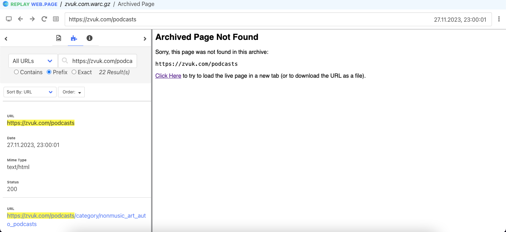
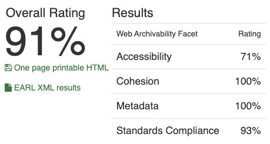

# Архив топа подкастов на Zvuk.com

## 1. Работа с Wpull

### Саммари

Этот раздел содержит результаты архивации сайта с использованием инструмента Wpull.
В ходе работы использовался скрипт массовой загрузки для извлечения коллекции нескольких архивов последовательно. Параметр глубины рекурсии выставлен на `r=5` для ограничения по времени и памяти для архивации. При архивации более чем 1ч.30мин, прерываем выполнение работы архиватора

### Результаты

К сожалению, чарт Zvuk.com не удается запустить в программах просмотра архивов (replay-web.page отображает множество страниц но при переходе на любую из них возникает ошибка как будто страницы не существует)

## 2. Работа с Archive Ready

### Саммари

Этот раздел содержит результаты архивации сайта с использованием инструмента Archive Ready. В данном разделе мы пытаемся оценить архив не только с точки зрения постановленной задачи, но также с точки зрения стандартов архивирования в соостветствие в метриками CLEAR.

### Результаты

Согласно метрикам CLEAR и ArchiveReady сервис Zvuk оказывается самым приспособленным к архивации, что противоречит нашим результатам из предыдущего пункта (wpull также загрузил множество файлов отображаемых в replay-web.page, но ни один из загруженных файлов не открывается в replay-web.page)

- HTML and CSS: по несколько ошибок каждого типа (в HTML, в CSS, в inline-js)
- HTTP: без предупреждений и ошибок
- Media: долгое время ответа (670мс), других ошибок нет
- Sitemaps: accessibility: наличие Disallow в robots.txt, но присутствует sitemaps.xml

## 3. Работа с MetaWarc

### Саммари

Этот раздел содержит результаты архивации сайта с использованием инструмента MetaWarc.
В данной работе мы исследовали метаданные архива с помощью `metawarc` использовав несколько функций утилиты:
- analyze
- metadata
- index
- stats

### Описание работы

1. `metawarc analyze zvuk.com.warc.gz`
<pre>
mimes                            files       size          share
-----------------------------  -------  ---------  -------------
image/png                         1402  177290618   46.005
text/html                          303  116786289   30.3048
image/jpeg                        1420   62736387   16.2794
audio/x-wav                          1    7627716    1.97931
application/json                    36    6080841    1.57791
application/javascript              58    5036677    1.30696
video/mp4                            1    4159622    1.07938
application/octet-stream            35    2330557    0.604755
application/vnd.ms-fontobject       15    1104086    0.286499
image/svg+xml                       33     645191    0.16742
video/webm                           1     437104    0.113424
text/css                            19     407844    0.105831
font/woff                            9     303165    0.0786681
font/woff2                          11     270610    0.0702204
text/xml                             8     130138    0.0337694
image/x-icon                         1      15724    0.00408021
image/vnd.microsoft.icon             1       4932    0.0012798
text/plain                          11       3936    0.00102135
application/manifest+json            1        704    0.000182681
#total                            3366  385372141  100
</pre>

Интересно, какое большое количество файлов попало в архив и какие разные форматы представлены (от plain текста до видео в `.mp4`)

2. `metawarc metadata --output digital_meta.jsonl zvuk.com.warc.gz`

Результаты работы команды мы можем пронаблюдать в файле [`digital_meta.jsonl`](./digital_meta.jsonl).
Интересно пронаблюдать, что команда возвращает длинный список на более чем `2800` строчек метаданных. При этом большая часть изображений возаращает ошибку `Unable to parse file pic` что в некотором смысле подтверждает предыдущий пункт

3. `metawarc index zvuk.com.warc.gz`

В результате создана служебная БД `metawarc.db` содержащая HTTP метаданные для использования командой `stats`

4. `metawarc stats -m mimes`
<pre>
                 Group by mime type                  
┏━━━━━━━━━━━━━━━━━━━━━━━━━━━━━━━┳━━━━━━━━━━━┳━━━━━━━┓
┃ mime                          ┃ size      ┃ count ┃
┡━━━━━━━━━━━━━━━━━━━━━━━━━━━━━━━╇━━━━━━━━━━━╇━━━━━━━┩
│ application/javascript        │ 5036677   │    58 │
│ application/json              │ 6080841   │    36 │
│ application/manifest+json     │ 704       │     1 │
│ application/octet-stream      │ 2330557   │    35 │
│ application/vnd.ms-fontobject │ 1104086   │    15 │
│ audio/x-wav                   │ 7627716   │     1 │
│ font/woff                     │ 303165    │     9 │
│ font/woff2                    │ 270610    │    11 │
│ image/jpeg                    │ 62736387  │  1420 │
│ image/png                     │ 177290618 │  1402 │
│ image/svg+xml                 │ 645191    │    33 │
│ image/vnd.microsoft.icon      │ 4932      │     1 │
│ image/x-icon                  │ 15724     │     1 │
│ text/css                      │ 407844    │    19 │
│ text/html                     │ 525817    │     5 │
│ text/html; charset=UTF-8      │ 1650935   │    13 │
│ text/html; charset=utf-8      │ 114609537 │   285 │
│ text/plain; charset=UTF-8     │ 3936      │    11 │
│ text/xml                      │ 130138    │     8 │
│ video/mp4                     │ 4159622   │     1 │
│ video/webm                    │ 437104    │     1 │
└───────────────────────────────┴───────────┴───────┘
</pre>

5. `metawarc stats -m exts`

<pre>
      Group by file extension      
┏━━━━━━━━━━━━━┳━━━━━━━━━━━┳━━━━━━━┓
┃ extension   ┃ size      ┃ count ┃
┡━━━━━━━━━━━━━╇━━━━━━━━━━━╇━━━━━━━┩
│             │ 184842596 │  1755 │
│ book        │ 398       │     1 │
│ css         │ 407844    │    19 │
│ eot         │ 1104387   │    16 │
│ html        │ 1023      │     1 │
│ ico         │ 20656     │     2 │
│ jpeg        │ 112186    │     3 │
│ jpg         │ 468174    │     1 │
│ js          │ 5036677   │    58 │
│ me          │ 12186     │     1 │
│ mp3         │ 12224     │     1 │
│ mp4         │ 4159622   │     1 │
│ png         │ 177453208 │  1417 │
│ svg         │ 645191    │    33 │
│ ttf         │ 2325116   │    25 │
│ txt         │ 1216      │     1 │
│ wav         │ 7627716   │     1 │
│ webm        │ 437104    │     1 │
│ webmanifest │ 704       │     1 │
│ woff        │ 303165    │     9 │
│ woff2       │ 270610    │    11 │
│ xml         │ 130138    │     8 │
└─────────────┴───────────┴───────┘
</pre>

- Интересно наблюдать большое количество файлов и расширений при полной невозможности открыть страницы архива